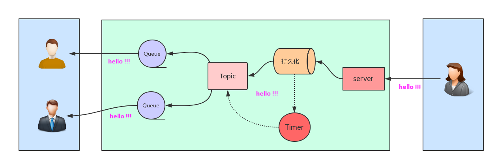

# go_pubsub

go_pubsub 是基于redis protocol 实现的pubsub服务端. 兼容常见的redis client及sdk. 使用方法和设计原理跟go nsq 很像...



`to do list:`

* 持久化
* 丰富增删改查

## 依赖包:

```
go get github.com/BurntSushi/toml
```

## 演示:

`server:`

```
go run cmd/main.go
```

`client:`

```
[gopy@xiaorui ~ ]$ redis-cli -p 9999

# AUTH
127.0.0.1:9999> auth your_password

# 添加topic
127.0.0.1:9999> create topic xiaorui.cc

# 绑定topic和queue_name的关系
127.0.0.1:9999> bind xiaorui.cc queue1

# 给topic为xiaorui.cc发送 hello 信息
127.0.0.1:9999> PUBLISH xiaorui.cc hello
OK

# 接收信息
127.0.0.1:9999> SUBSCRIBE xiaorui.cc queue1
Reading messages... (press Ctrl-C to quit)
hello
```
